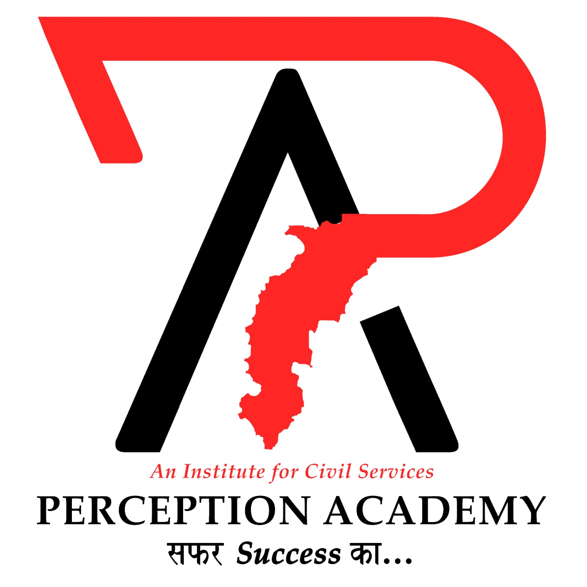

📊 Exam Marks Calculator by Piyush Pandey
A powerful, lightweight, and installable web application designed for aspirants appearing for CGPSC and CG Vyapam exams. This tool helps candidates calculate their accurate marks after negative marking, track performance trends with charts, and export reports as PDFs.
🚀 Features
Dual Category Support: Dedicated calculators for CGPSC and CG Vyapam.
Precise Formulas: * CGPSC: (Correct * 2) - (Incorrect * 0.666)
CG Vyapam: (Correct * 1) - (Incorrect * 0.250)
Performance Tracking:
Interactive Line Chart: Visualize your score progress over time using Chart.js.
History Log: Automatically saves the date, time, and custom exam name for every attempt.
Export & Print:
PDF Export: Generate a professional performance report.
Print Optimization: Clean print view that hides inputs and focuses on your results.
Android Ready: Includes an "Install App" feature to add the tool to your mobile home screen.
Branding: Personalized footer ©Piyush Pandey visible on every page and exported document.
🛠️ Technical Stack
HTML5: Structure and Semantic layout.
CSS3: Responsive design with Print Media support.
JavaScript (ES6): Calculation logic and DOM manipulation.
Chart.js: For data visualization.
html2pdf.js: For client-side PDF generation.
📂 Installation & Usage
1. Local Use
Download the index.html file.
Open it in any modern web browser (Chrome, Edge, or Safari).
2. Android Installation
Open the tool in Chrome on your Android device.
Tap the "Install App" button at the bottom.
If the automatic prompt doesn't appear, tap the three dots (⋮) in Chrome and select "Add to Home screen".
3. Adding your Logo
To use your own logo, look for this line in the code:

📝 Usage Instructions
Select your exam category (CGPSC or CG Vyapam).
Enter the Name of the Exam (e.g., "Mock Test 01").
Enter the number of Correct and Incorrect answers.
Click Calculate & Plot Score.
View your score in the history table and see the graph update instantly.
Use the Print or Save PDF buttons to keep a record of your preparation.
⚖️ License & Copyright
© 2026 Piyush Pandey. All rights reserved.
This tool is intended for educational purposes to help students estimate their exam scores.

##License
This project is licensed under the GNU GENERAL PUBLIC LICENSE - see the [LICENSE] (LICENSE) file for details.
